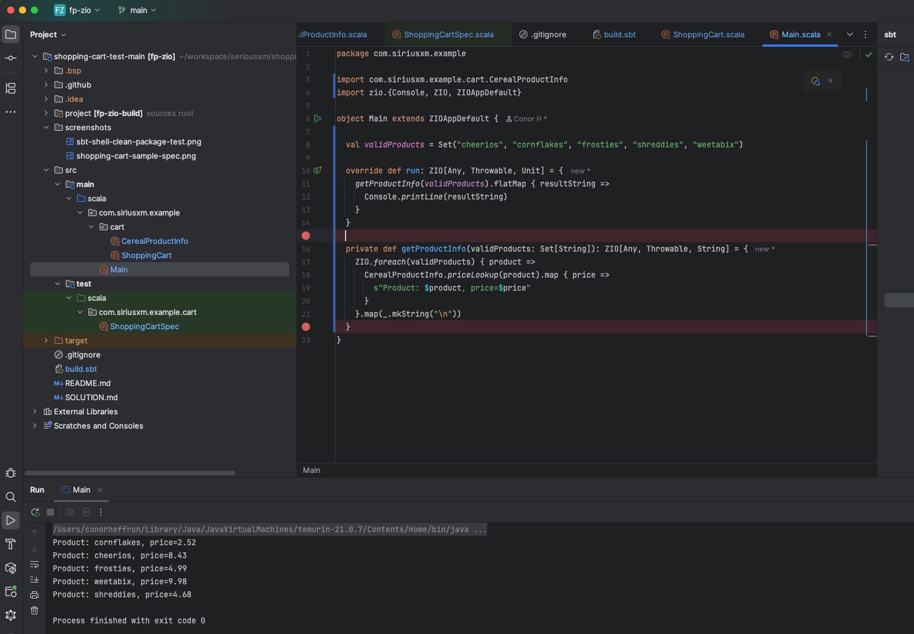

# shoppingcart-scala

## Tech:
 - SBT 1.11.6, Scala 3.7.2, ZIO 2

## SBT shell build.
 - clean package test
 

## Run Sample Cart Calculation via Spec test suite.

## Main class run - prints each valid product info

